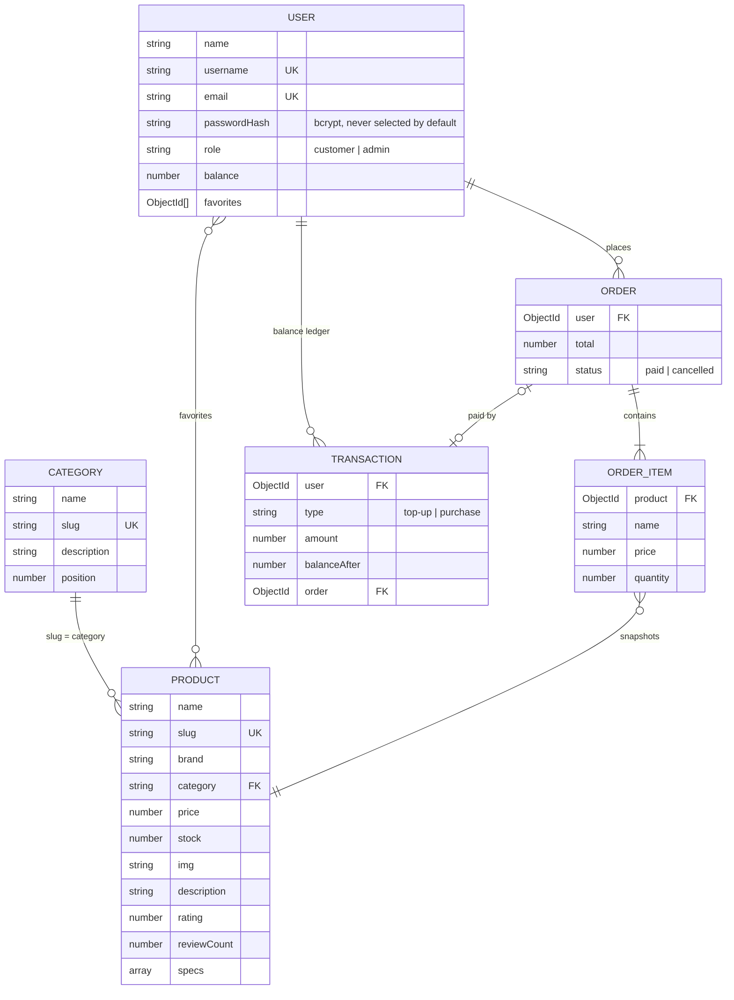

# 🎮 Game Store

A prototype of an e-commerce site selling game products.

This project was developed using **React, TypeScript, Node.js, Express** and **Apollo GraphQL**.


This project inspired from [@folab](https://www.figma.com/@folab)'s [Game Drill design](https://www.figma.com/community/file/1138582638202684580).

Get the **live version** without installation **in [here](https://radiant-spire-46493.herokuapp.com/ "Live preview")**.

## Installation Prerequisites

> Make sure you have **Node.js 22 or newer** installed on your system.
>
> A local [MongoDB](https://www.mongodb.com/try/download/community) is optional during development: when `MONGO_URI` is not set, the backend starts a temporary in-memory MongoDB seeded with demo data.

If you haven't cloned this repository to your local machine yet, clone it first with fetch options (HTTPS, SSH, GitHub CLI).

If you have already cloned, you can skip to **Installation & Running** steps.

**Clone this repository**

Open your terminal and clone this repository to your local with the HTTPS option.

```bash
$ git clone https://github.com/ilhanozkan/game-store.git
```

## Installation & Running

### Backend

1 - Create environment variables file

Create a file named `.env` under the `backend` folder.

Example **.env** file (see [`backend/.env.example`](backend/.env.example)):

```bash
# Optional during development: leave it out to use a temporary in-memory database
# MONGO_URI=mongodb://127.0.0.1:27017/game-store
PORT=5000
# Required whenever MONGO_URI is set; generate one with
# node -e "console.log(require('crypto').randomBytes(32).toString('hex'))"
# JWT_SECRET=
JWT_EXPIRES_IN=7d
CORS_ORIGIN=http://localhost:3000
```

| Variable         | Default                       | Description                                                                                                  |
| ---------------- | ----------------------------- | ------------------------------------------------------------------------------------------------------------ |
| `MONGO_URI`      | _in-memory database_          | MongoDB connection string. Required unless `NODE_ENV` is unset, `development` or `test`.                     |
| `PORT`           | `5000`                        | Port for both the GraphQL (`/graphql`) and REST (`/api`) endpoints.                                          |
| `JWT_SECRET`     | _random, per process_         | Secret used to sign login tokens (at least 32 characters). Required whenever `MONGO_URI` is set.             |
| `JWT_EXPIRES_IN` | `7d`                          | How long login tokens stay valid.                                                                            |
| `CORS_ORIGIN`    | `*`                           | Comma-separated origins allowed to call the API.                                                             |
| `DEMO_WALLET`    | `true`, `false` in production | Allows free store-credit top-ups through `topUpBalance`.                                                     |
| `TRUST_PROXY`    | _off_                         | Express `trust proxy` setting (e.g. `1`) when running behind a load balancer, so rate limits see client IPs. |

2 - Install dependencies

Navigate to the backend folder in terminal.

```bash
cd game-store/backend
```

Run installation command in terminal.

```bash
npm i
```

3 - Seed the database

Load the categories, products and demo accounts into the database configured by `MONGO_URI`. Re-running it is safe: it restores the seeded categories and products (including their stock and prices), never touches existing users or orders, and never deletes anything. Add `-- --reset` to drop every collection first, which is also how to upgrade a database created with the old schema.

```bash
npm run seed
```

You can skip this step when running without `MONGO_URI`, because the in-memory database is seeded automatically.

4 - Start the backend

Start the backend in development (restarts on file changes):

```bash
npm run dev
```

Use `npm start` to run it without watching. The API is then available at:

- GraphQL: `http://localhost:5000/graphql` (open it in a browser for Apollo Sandbox)
- REST: `http://localhost:5000/api`

Run the backend test suite with `npm test`.

### Frontend

1 - Create environment variables file (optional)

Create a file named `.env.local` under the `frontend` folder (see [`frontend/.env.example`](frontend/.env.example)). Without it, the app talks to `http://localhost:5000/graphql`.

Example **.env.local** file:

```bash
REACT_APP_API_URL=http://localhost:5000/graphql
```

2 - Install dependencies

Navigate to the frontend folder in terminal.

```bash
cd game-store/frontend
```

Run installation command in terminal.

```bash
npm i
```

3 - Start the frontend

Start the frontend in development and open [http://localhost:3000](http://localhost:3000).

```bash
npm start
```

Other useful scripts:

| Command         | Description                                      |
| --------------- | ------------------------------------------------ |
| `npm test`      | Runs the component and unit tests in watch mode. |
| `npm run lint`  | Lints the code with ESLint and Prettier.         |
| `npm run build` | Creates an optimized production build.           |

## Features

- **Catalog**: browse all products, categories with product counts, product pages with specifications and related products, and fuzzy search.
- **Accounts**: register and sign in; sessions persist across reloads and expire safely.
- **Cart and checkout**: the cart is saved in the browser and synced across tabs, re-checked against live stock and prices when you open it, and checks out against the store balance.
- **Favorites**: save products with the heart button; favorites follow your account.
- **Balance**: top up demo store credit and review every top-up and purchase.
- **Profile**: edit your details and review your order history.
- **Admin**: admins can add products from the **New product** page.
- **Responsive and accessible**: the layout adapts from phones to wide screens with an off-canvas menu; keyboard users get a skip link, visible focus rings and drawers that trap and restore focus; toasts and loading states are announced to screen readers, and animations respect reduced-motion settings.

## Demo accounts

The seed creates two accounts for local development:

| Username | Password       | Role     | Store balance |
| -------- | -------------- | -------- | ------------- |
| `fola`   | `gamestore123` | customer | ₦500,000      |
| `admin`  | `admin12345`   | admin    | ₦0            |

> These credentials are for local development only. `npm run seed` skips them when `NODE_ENV=production` unless you pass `-- --demo-users`.

## Data model

Seed data lives in [`backend/data`](backend/data) and the Mongoose models in [`backend/models`](backend/models). Prices and balances are stored in whole Naira (NGN).



## API

The backend serves GraphQL and a small read-mostly REST API from the same port. Authenticated requests send `Authorization: Bearer <token>`, where the token comes from the `login` or `register` mutation.

### GraphQL (`/graphql`)

| Operation                                       | Auth     | Description                                                     |
| ----------------------------------------------- | -------- | --------------------------------------------------------------- |
| `products(category, search, sort, inStockOnly)` | –        | Lists products. `category` accepts a slug or a name.            |
| `product(id)`                                   | –        | Finds a product by ID or slug.                                  |
| `categories`, `category(slug)`                  | –        | Categories with product counts.                                 |
| `me`                                            | optional | The signed-in user, or `null`.                                  |
| `myOrders`, `myTransactions`                    | user     | Order history and balance ledger, newest first.                 |
| `register(input)`, `login(input)`               | –        | Return `{ token, user }`. `login` accepts a username or email.  |
| `updateProfile(input)`                          | user     | Updates name, email or avatar URL.                              |
| `toggleFavorite(productId)`                     | user     | Adds or removes a favorite.                                     |
| `topUpBalance(amount)`                          | user     | Adds demo store credit (whole Naira).                           |
| `checkout(items)`                               | user     | Pays for the cart from the balance, reserving stock atomically. |
| `createProduct(input)`                          | admin    | Adds a product to the catalog.                                  |

Errors carry an `extensions.code`: `BAD_USER_INPUT`, `UNAUTHENTICATED`, `FORBIDDEN`, `NOT_FOUND`, `CONFLICT`, `INSUFFICIENT_BALANCE`, `TOO_MANY_REQUESTS` or `INTERNAL_SERVER_ERROR`, plus Apollo's own `GRAPHQL_PARSE_FAILED` and `GRAPHQL_VALIDATION_FAILED` for malformed operations.

Failed sign-ins are limited to 10 per client every 15 minutes and registrations to 10 per hour. Checkout reserves stock and charges the balance with conditional atomic updates and undoes them if a later step fails; it works on a standalone MongoDB, but a process crash mid-checkout can leave reserved stock behind (a replica set with transactions would close that gap).

### REST (`/api`)

| Method & path                      | Auth  | Description                                                                    |
| ---------------------------------- | ----- | ------------------------------------------------------------------------------ |
| `GET /api/health`                  | –     | Service and database status.                                                   |
| `GET /api/categories`              | –     | All categories in navigation order.                                            |
| `GET /api/products`                | –     | Query params: `category`, `search`, `sort` (e.g. `price_asc`), `inStock=true`. |
| `GET /api/products/category/:name` | –     | Products in a category (slug or name).                                         |
| `GET /api/products/:idOrSlug`      | –     | A single product, or `404`.                                                    |
| `POST /api/products`               | admin | Creates a product.                                                             |

REST errors are returned as `{ "error": { "message", "code" } }` with a matching HTTP status. Note that REST returns raw documents, so a product's `category` is its slug (e.g. `vr-glasses`), while GraphQL resolves `category` to the display name and exposes the slug as `categorySlug`.

## License

MIT License

Copyright (c) 2022 Ilhan Ozkan

Permission is hereby granted, free of charge, to any person obtaining a copy
of this software and associated documentation files (the "Software"), to deal
in the Software without restriction, including without limitation the rights
to use, copy, modify, merge, publish, distribute, sublicense, and/or sell
copies of the Software, and to permit persons to whom the Software is
furnished to do so, subject to the following conditions:

The above copyright notice and this permission notice shall be included in all
copies or substantial portions of the Software.

THE SOFTWARE IS PROVIDED "AS IS", WITHOUT WARRANTY OF ANY KIND, EXPRESS OR
IMPLIED, INCLUDING BUT NOT LIMITED TO THE WARRANTIES OF MERCHANTABILITY,
FITNESS FOR A PARTICULAR PURPOSE AND NONINFRINGEMENT. IN NO EVENT SHALL THE
AUTHORS OR COPYRIGHT HOLDERS BE LIABLE FOR ANY CLAIM, DAMAGES OR OTHER
LIABILITY, WHETHER IN AN ACTION OF CONTRACT, TORT OR OTHERWISE, ARISING FROM,
OUT OF OR IN CONNECTION WITH THE SOFTWARE OR THE USE OR OTHER DEALINGS IN THE
SOFTWARE.
