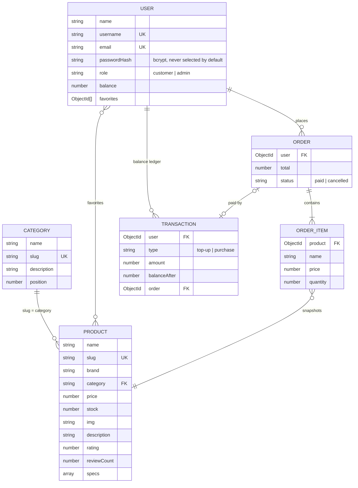

# 🎮 Game Store

A prototype of an e-commerce site selling game products.

This project was developed using **React, TypeScript, Node.js, Express** and **Apollo GraphQL**.


This project inspired from [@folab](https://www.figma.com/@folab)'s [Game Drill design](https://www.figma.com/community/file/1138582638202684580).

Get the **live version** without installation **in [here](https://radiant-spire-46493.herokuapp.com/ "Live preview")**.

## Installation Prerequisites

> Make sure you have **Node.js 22 or newer** installed on your system.
>
> A local [MongoDB](https://www.mongodb.com/try/download/community) is optional during development: when `MONGO_URI` is not set, the backend starts a temporary in-memory MongoDB seeded with demo data.

If you haven't cloned this repository to your local machine yet, clone it first with fetch options (HTTPS, SSH, GitHub CLI).

If you have already cloned, you can skip to **Installation & Running** steps.

**Clone this repository**

Open your terminal and clone this repository to your local with the HTTPS option.

```bash
$ git clone https://github.com/ilhanozkan/game-store.git
```

## Installation & Running

### Backend

1 - Create environment variables file

Create a file named `.env` under the `backend` folder.

Example **.env** file (see [`backend/.env.example`](backend/.env.example)):

```bash
# Optional during development: leave it out to use a temporary in-memory database
# MONGO_URI=mongodb://127.0.0.1:27017/game-store
PORT=5000
APOLLO_PORT=4000
REST_API_URL=http://localhost:5000
```

`MONGO_URI` is required whenever `NODE_ENV` is set to anything other than `development` or `test`.

2 - Install dependencies

Navigate to the backend folder in terminal.

```bash
cd game-store/backend
```

Run installation command in terminal.

```bash
npm i
```

3 - Seed the database

Load the categories, products and demo accounts into the database configured by `MONGO_URI`. Re-running it is safe: it restores the seeded categories and products (including their stock and prices), never touches existing users or orders, and never deletes anything. Add `-- --reset` to drop every collection first, which is also how to upgrade a database created with the old schema.

```bash
npm run seed
```

You can skip this step when running without `MONGO_URI`, because the in-memory database is seeded automatically.

4 - Start the backend

Start the backend in development.

```bash
npm start
```

Run the backend test suite with `npm test`.

### Frontend

1 - Create environment variables file

Create a file named `.env.local` under the `frontend` folder.

Example **.env.local** file:

```bash
REACT_APP_API_URL=http://localhost:4000
REACT_APP_REST_API_URL=http://localhost:5000
```

2 - Install dependencies

Navigate to the frontend folder in terminal.

```bash
cd game-store/frontend
```

Run installation command in terminal.

```bash
npm i
```

3 - Start the frontend

Start the frontend in development.

```bash
npm start
```

## Demo accounts

The seed creates two accounts for local development:

| Username | Password       | Role     | Store balance |
| -------- | -------------- | -------- | ------------- |
| `fola`   | `gamestore123` | customer | ₦500,000      |
| `admin`  | `admin12345`   | admin    | ₦0            |

> These credentials are for local development only. `npm run seed` skips them when `NODE_ENV=production` unless you pass `-- --demo-users`.

## Data model

Seed data lives in [`backend/data`](backend/data) and the Mongoose models in [`backend/models`](backend/models). Prices and balances are stored in whole Naira (NGN).



## License

MIT License

Copyright (c) 2022 Ilhan Ozkan

Permission is hereby granted, free of charge, to any person obtaining a copy
of this software and associated documentation files (the "Software"), to deal
in the Software without restriction, including without limitation the rights
to use, copy, modify, merge, publish, distribute, sublicense, and/or sell
copies of the Software, and to permit persons to whom the Software is
furnished to do so, subject to the following conditions:

The above copyright notice and this permission notice shall be included in all
copies or substantial portions of the Software.

THE SOFTWARE IS PROVIDED "AS IS", WITHOUT WARRANTY OF ANY KIND, EXPRESS OR
IMPLIED, INCLUDING BUT NOT LIMITED TO THE WARRANTIES OF MERCHANTABILITY,
FITNESS FOR A PARTICULAR PURPOSE AND NONINFRINGEMENT. IN NO EVENT SHALL THE
AUTHORS OR COPYRIGHT HOLDERS BE LIABLE FOR ANY CLAIM, DAMAGES OR OTHER
LIABILITY, WHETHER IN AN ACTION OF CONTRACT, TORT OR OTHERWISE, ARISING FROM,
OUT OF OR IN CONNECTION WITH THE SOFTWARE OR THE USE OR OTHER DEALINGS IN THE
SOFTWARE.
